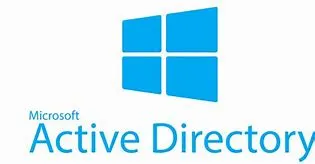

### What is Active Directory
Active Directory (AD) is a centralized management system that acts as a digital "phonebook" and security guard for a company's network. It stores information about users, computers, and printers in a single database, allowing IT administrators to manage everyone’s access from one location. When you log in at work, AD verifies your identity and ensures you have the correct permissions to access specific files or software. By using tools like Group Policy, admins can automatically apply security rules or updates to thousands of computers at once, making it the backbone of security and organization for most modern businesses.

### Setting up Active Directory (AD)

- **Prerequisites**:
    - **A Host Computer:** Ideally with at least 16GB of RAM (8GB can work but will be slow).
    - **Hypervisor:** Download Oracle VirtualBox or VMware Workstation Player (both free).
    - **Windows Server ISO:** Download the Windows Server 2022 Evaluation (free for 180 days)