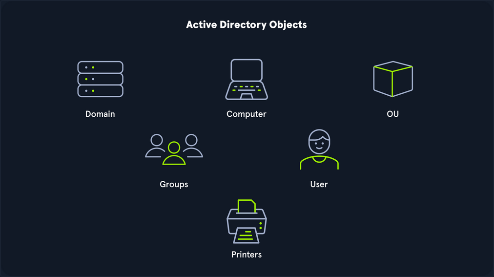

# Active-Directory ReadMe
This repository serves as a personal knowledge base and learning log for mastering Active Directory (AD) concepts, exploitation, and defense techniques. The focus is on practical application within controlled lab environments, primarily using virtual machines through VMware and learning tracks through HTB.

# Active Directory Structure Example

```text
ExampleCorp.com (Domain)
├── Built-in (Default Container)
├── Computers (Default Container)
├── Users (Default Container)
└── Organizational Units (OUs - Custom Management Structure)
    ├── Infrastructure
    │   ├── Servers
    │   │   ├── Production Servers
    │   │   └── Test/Development Servers
    │   └── Shared Assets
    │       ├── Printers (Container)
    │       └── Service Accounts (Container)
    ├── Departments
    │   ├── IT Services
    │   │   ├── IT Support
    │   │   ├── Network Operations
    │   │   ├── Users (Container)
    │   │   └── Computers (Container)
    │   ├── Finance
    │   │   ├── Users (Container)
    │   │   └── Computers (Container)
    │   └── Sales & Marketing
    │       ├── Users (Container)
    │       └── Computers (Container)
    └── USA (Geographical OU)
        ├── HQ - Atlanta
        └── West Coast Offices
```

# Active Directory Key Terms

## Core Terms

- **Forest:** The topmost container; a collection of one or multiple Active Directory domains. Each forest operates independently and contains all AD objects.
- **Domain:** A logical group of objects (computers, users, OUs, groups, etc.). Domains can operate independently or be connected via trust relationships.
- **Tree:** A collection of Active Directory domains that begins at a single root domain. All domains in a tree share a Global Catalog and a common namespace boundary.
- **Object:** Any resource present within an Active Directory environment, such as OUs, printers, users, and domain controllers.
- **Attributes:** An associated set of characteristics used to define a given object (e.g., hostname, DNS name, displayName). All attributes have an associated LDAP name.
- **Schema:** The blueprint of the AD environment. It defines what types of objects can exist in the AD database and their associated attributes.
- **Container:** Objects that hold other objects and have a defined place in the directory subtree hierarchy (e.g., Organizational Units, or OUs).
- **Leaf:** Objects that do not contain other objects and are found at the end of the subtree hierarchy (e.g., a specific user or computer).

## Security & Identification

- **Security Principals:** Anything the operating system can authenticate (users, computer accounts, or service accounts). They are domain objects that can manage access to other resources.
- **Security Identifier (SID):** A unique identifier for a security principal or security group, issued by the domain controller. It is used to create an access token upon user login to check rights.
- **Global Unique Identifier (GUID):** A unique 128-bit value assigned to every object created in Active Directory. It is stored in the `objectGUID` attribute and never changes.
- **Distinguished Name (DN):** The full path to an object in AD (e.g., cn=bjones,ou=IT,dc=inlanefreight,dc=local). It uniquely identifies the object in the directory structure.
- **Relative Distinguished Name (RDN):** A single component of the Distinguished Name that identifies the object as unique from other objects at the current level in the naming hierarchy (e.g., cn=bjones).
- **sAMAccountName:** The user's logon name (e.g., bjones). It must be unique and 20 or fewer characters.
- **userPrincipalName:** An alternative way to identify users, consisting of a prefix and a suffix (e.g., bjones@inlanefreight.local). This attribute is not mandatory.
- **sIDHistory:** An attribute that holds SIDs previously assigned to an object, commonly used during domain migrations to maintain access levels.

## Access Control Structures (ACLs)

- **Access Control List (ACL):** The ordered collection of Access Control Entries (ACEs) that apply to an object.
- **Access Control Entry (ACE):** Identifies a trustee (user or group) and lists the access rights that are allowed, denied, or audited for that trustee.
- **Discretionary Access Control List (DACL):** Specifies which security principals are granted or denied access to an object; evaluated during access checks.
- **System Access Control List (SACL):** Specifies audit settings; ACEs in a SACL cause the system to generate security log records for matching access attempts.

## Administration & Infrastructure

- **FSMO Roles (Flexible Single Master Operation):** Specialized roles assigned to certain Domain Controllers (DCs) to handle specific tasks (e.g., Schema Master, PDC Emulator) and ensure critical services run correctly without conflict.
- **Global Catalog (GC):** A Domain Controller that stores copies of many objects in an Active Directory forest, facilitating searches for objects across domains.
- **Read-Only Domain Controller (RODC):** A DC with a read-only AD database. No account passwords are cached (except for the RODC's own account), used to reduce attack surface in less secure locations.
- **Replication:** The process by which AD object updates are transferred and synchronized from one Domain Controller to another, managed by the Knowledge Consistency Checker (KCC).
- **Service Principal Name (SPN):** A unique identifier for a service instance, used by Kerberos authentication to associate the service with a logon account.
- **Group Policy Object (GPO):** Collections of policy settings (security, desktop, software install) applied to user and computer objects within the domain or an OU.
- **SYSVOL:** The shared folder that stores copies of domain public files, such as system policies, GPOs, and logon/logoff scripts.
- **NTDS.DIT:** The Active Directory database file stored on Domain Controllers. It contains AD data, including user and group information and password hashes for domain users.
- **Active Directory Users and Computers (ADUC):** A common GUI console used for managing users, groups, computers, and contacts in AD.
- **ADSI Edit:** A powerful GUI tool that provides deep access to AD objects, allowing management of almost any attribute. Changes should be made with extreme care.
- **Fully Qualified Domain Name (FQDN):** The complete name for a specific computer or host, written as host.domain.tld (e.g., DC01.INLANEFREIGHT.LOCAL).

## Maintenance & Security Mechanisms

- **Tombstone:** A marker for deleted AD objects retained for a set period (Tombstone Lifetime) before final removal. Most attributes are stripped upon tombstoning.
- **AD Recycle Bin:** A feature that preserves deleted AD objects for a set period, facilitating restoration without losing most of the object's attributes.
- **AdminSDHolder:** An object used to manage ACLs for members of built-in groups marked as privileged (e.g., Domain Admins). The SDProp process runs periodically to enforce this object's security descriptor.
- **dsHeuristics:** An attribute used to define forest-wide configuration settings, including the exclusion of built-in groups from AdminSDHolder protection.
- **adminCount:** An attribute that determines whether or not the SDProp process protects a user. A value of 1 means the user is protected (usually a privileged account).
- **MSBROWSE:** A largely obsolete Microsoft networking protocol used in older Windows LANs to provide browsing services and maintain a list of available resources.

# Active Directory Objects


## Leaf Objects (Cannot contain other objects)

| Term | Definition | Security Principal? | ID(s) |
| --- | --- | ---: | --- |
| Users | Represents an individual within the organization. A crucial target for attackers due to the access they grant. | Yes | SID & GUID |
| Contacts | Represents an external user (e.g., third-party vendor). Contains informational attributes (name, email) but is not a securable object. | No | Only GUID |
| Printers | Points to a physical printer accessible on the AD network. Has attributes like name and driver information. | No | Only GUID |
| Computers | Any machine (workstation or server) joined to the AD network. Gaining full administrative access (NT AUTHORITY\\SYSTEM) grants similar rights to a standard domain user. | Yes | SID & GUID |
| Shared Folders | Points to a shared folder residing on a specific computer. Access control can be highly restrictive or open to all authenticated users. | No | Only GUID |

## Container and Structural Objects

- **Groups:** A container object that manages user permissions and access to other securable objects. Can contain users, computers, and other groups (nested groups). A group is a security principal.
- **Organizational Units (OUs):** A container used by systems administrators to store similar objects for ease of administration and to apply fine-grained administrative delegation (for example, password reset rights) and Group Policy settings.
- **Domain:** The fundamental structure of an AD network. It contains users and computers, organized into groups and OUs. Each domain has its own separate database and policies.
- **Domain Controllers (DC):** The domain controllers handle authentication requests, enforce security policies, and store the directory database.
- **Sites:** A set of computers across one or more subnets connected by high-speed links. Sites are used to make replication across domain controllers run efficiently.
- **Built-in:** A container that holds default security groups (for example, Domain Admins and Administrators) that are created when an AD domain is provisioned.
- **Foreign Security Principals (FSP):** A placeholder object created in the current AD forest to represent a security principal (user or group) that belongs to a trusted external forest; used to resolve names and SIDs across trusts.

## Active Directory Infrastructure

### 1. Flexible Single Master Operation (FSMO) Roles

These five specialized roles are distributed among Domain Controllers (DCs) to ensure consistency and prevent conflicts across the domain or forest.

| FSMO Role | Scope | Description |
| --- | --- | --- |
| Schema Master | Forest | Manages the single read/write copy of the AD schema, which defines all possible objects and attributes in the entire forest. |
| Domain Naming Master | Forest | Manages domain names and ensures that two domains with the same name are not created within the same forest. |
| Relative ID (RID) Master | Domain | Assigns unique blocks of Relative IDs (RIDs) to DCs within the domain. This ensures every new object receives a unique SID within that domain. |
| PDC Emulator | Domain | The authoritative DC that handles authentication requests, processes password changes, manages Group Policy Objects (GPOs), and maintains time synchronization across the domain. |
| Infrastructure Master | Domain | Translates GUIDs, SIDs, and DNs between domains. Critical in multi-domain forests to ensure references (like group membership from another domain) are correctly displayed. |

### 2. Global Catalog and Replication

- **Global Catalog (GC):** A Domain Controller that stores a full copy of all objects in its local domain and a partial copy of objects in every other domain in the forest; enables forest-wide searches.
- **Replication:** The process where AD object updates are transferred between Domain Controllers, managed by the Knowledge Consistency Checker (KCC); ensures synchronization and resiliency.

### Active Directory Trusts

A trust establishes authentication between separate domains or forests, allowing users from one to access resources in the other.

| Trust Type | Transitive? | Description |
| --- | --- | --- |
| Parent-Child | Two-way, Transitive | Automatically created between a parent domain and a new child domain within the same forest. |
| Tree-Root | Two-way, Transitive | Automatically created between the forest root domain and a new root domain of a different tree in the same forest. |
| Forest | Two-way, Transitive | A trust between two forest root domains, extending trust to every domain within both forests. |
| External | Non-transitive | A trust between two separate domains in separate forests that are not joined by a forest trust. Often uses SID filtering. |
| Cross-Link | Transitive | A trust between child domains to shorten the authentication path, speeding up access. |
| Transitive Trust |  | Trust is extended to objects that the trusted domain trusts (e.g., if A trusts B, and B trusts C, then A trusts C). |
| Non-Transitive Trust |  | Trust is limited only to the child domain itself, not extending to any other domains it may trust. |
| One-Way Trust |  | Users in a trusted domain can access resources in the trusting domain, but not vice-versa. |
| Two-Way (Bidirectional) Trust |  | Users from both trusting domains can access resources in the other. |

### Domain and Forest Functional Levels

Functional levels determine the features and capabilities available in AD, and which Windows Server OS can run as a DC.

| Functional Level | Key Features Introduced | Supported DC Operating Systems (example) |
| --- | --- | --- |
| Windows 2000 native | Universal groups, group nesting, group conversion, SID history. | Windows Server 2000 through 2008 R2 |
| Windows Server 2003 | lastLogonTimestamp, well-known containers, constrained delegation, selective authentication. | Windows Server 2003 through 2012 R2 |
| Windows Server 2008 | DFS replication support, AES 128/256 for Kerberos, Fine-grained password policies. | Windows Server 2008 through 2012 R2 |
| Windows Server 2008 R2 | Authentication mechanism assurance, Managed Service Accounts. | Windows Server 2008 R2 through 2012 R2 |
| Windows Server 2012 | KDC support for claims, compound authentication, and Kerberos armoring. | Windows Server 2012, 2012 R2 |
| Windows Server 2012 R2 | Extra protections for the Protected Users group, Authentication Policies/Silos. | Windows Server 2012 R2 |
| Windows Server 2016 | Smart card required for interactive logon, new Kerberos features, new credential protection. | Windows Server 2016, 2019 |
| Forest Level (2003) | Introduction of Forest Trust, Domain Renaming, and Read-Only Domain Controllers (RODC). |  |
| Forest Level (2008 R2) | Active Directory Recycle Bin is introduced, allowing restoration of deleted objects while AD DS is running. |  |
| Forest Level (2016) | Privileged Access Management (PAM) using Microsoft Identity Manager (MIM). |  |
