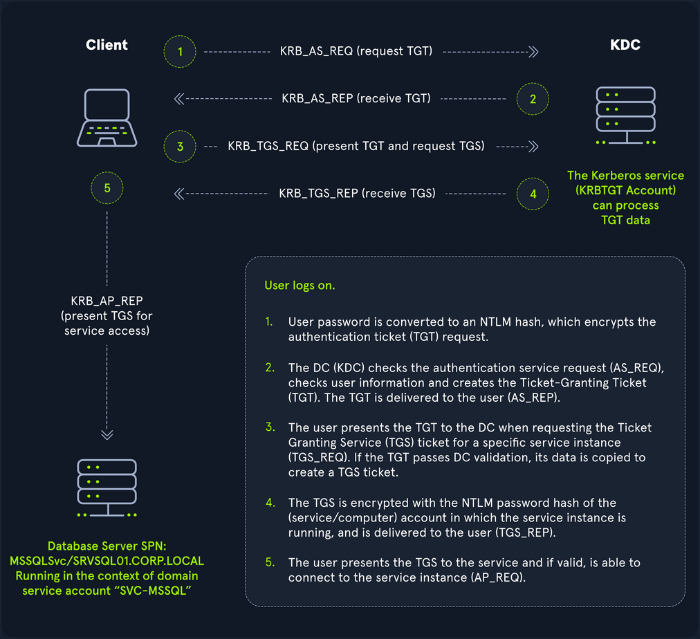
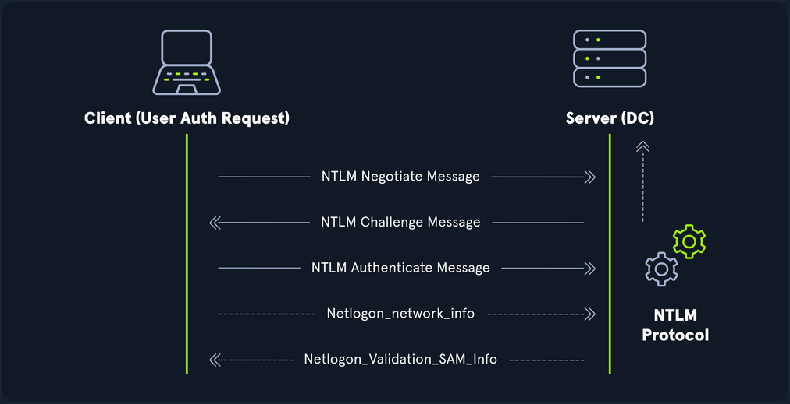
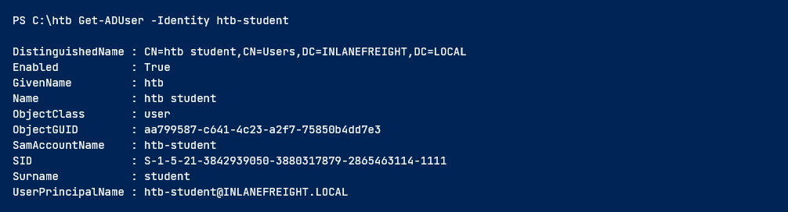
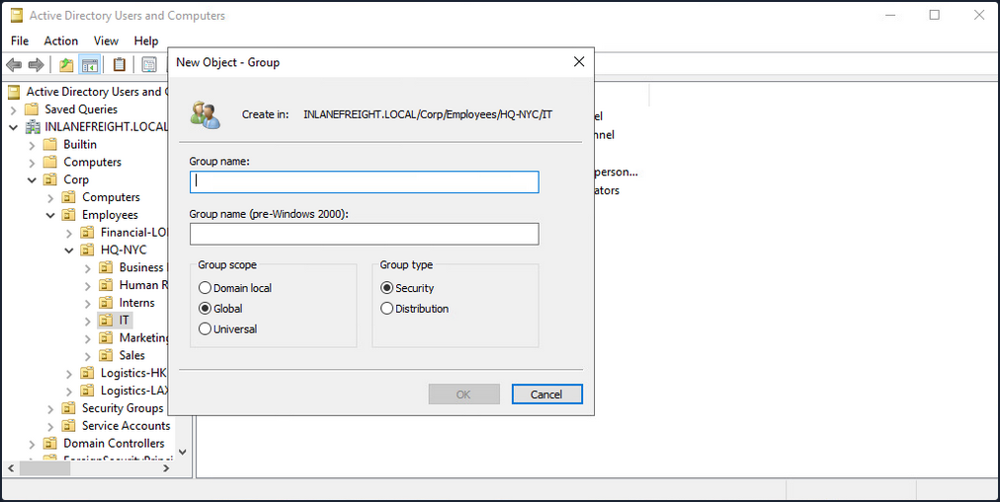

# Active-Directory ReadMe
This repository serves as a personal knowledge base and learning log for mastering Active Directory (AD) concepts, exploitation, and defense techniques. The focus is on practical application within controlled lab environments, primarily using virtual machines through VMware and learning tracks through HTB.

# Active Directory Structure Example

```text
ExampleCorp.com (Domain Root)
├── Built-in (Default Container)
├── Computers (Default Container)
├── Users (Default Container)
└── Organizational Units (OUs)
    ├── Infrastructure
    │   ├── Servers (OU)
    │   │   ├── Production Servers (OU)
    │   │   └── Test/Development Servers (OU)
    │   └── Shared Assets (OU)
    │       ├── Printers (Container)
    │       └── Service Accounts (Container)
    ├── Departments
    │   ├── IT Services (OU)
    │   │   ├── IT Support (OU)
    │   │   ├── Network Operations (OU)
    │   │   ├── Users (Container)
    │   │   └── Computers (Container)
    │   ├── Finance (OU)
    │   │   ├── Users (Container)
    │   │   └── Computers (Container)
    │   └── Sales & Marketing (OU)
    │       ├── Users (Container)
    │       └── Computers (Container)
    └── USA (Geographical OU)
        ├── HQ - Atlanta (OU)
        └── West Coast Offices (OU)
```

# Active Directory Key Terms

## Core Terms

- **Forest:** The topmost container; a collection of one or multiple Active Directory domains. Each forest operates independently and contains all AD objects.
- **Domain:** A logical group of objects (computers, users, OUs, groups, etc.). Domains can operate independently or be connected via trust relationships.
- **Tree:** A collection of Active Directory domains that begins at a single root domain. All domains in a tree share a Global Catalog and a common namespace boundary.
- **Object:** Any resource present within an Active Directory environment, such as OUs, printers, users, and domain controllers.
- **Attributes:** An associated set of characteristics used to define a given object (e.g., hostname, DNS name, displayName). All attributes have an associated LDAP name.
- **Schema:** The blueprint of the AD environment. It defines what types of objects can exist in the AD database and their associated attributes.
- **Container:** Objects that hold other objects and have a defined place in the directory subtree hierarchy (e.g., Organizational Units, or OUs).
- **Leaf:** Objects that do not contain other objects and are found at the end of the subtree hierarchy (e.g., a specific user or computer).

## Security & Identification

- **Security Principals:** Anything the operating system can authenticate (users, computer accounts, or service accounts). They are domain objects that can manage access to other resources.
- **Security Identifier (SID):** A unique identifier for a security principal or security group, issued by the domain controller. It is used to create an access token upon user login to check rights.
- **Global Unique Identifier (GUID):** A unique 128-bit value assigned to every object created in Active Directory. It is stored in the `objectGUID` attribute and never changes.
- **Distinguished Name (DN):** The full path to an object in AD (e.g., cn=bjones,ou=IT,dc=inlanefreight,dc=local). It uniquely identifies the object in the directory structure.
- **Relative Distinguished Name (RDN):** A single component of the Distinguished Name that identifies the object as unique from other objects at the current level in the naming hierarchy (e.g., cn=bjones).
- **sAMAccountName:** The user's logon name (e.g., bjones). It must be unique and 20 or fewer characters.
- **userPrincipalName:** An alternative way to identify users, consisting of a prefix and a suffix (e.g., bjones@inlanefreight.local). This attribute is not mandatory.
- **sIDHistory:** An attribute that holds SIDs previously assigned to an object, commonly used during domain migrations to maintain access levels.

## Access Control Structures (ACLs)

- **Access Control List (ACL):** The ordered collection of Access Control Entries (ACEs) that apply to an object.
- **Access Control Entry (ACE):** Identifies a trustee (user or group) and lists the access rights that are allowed, denied, or audited for that trustee.
- **Discretionary Access Control List (DACL):** Specifies which security principals are granted or denied access to an object; evaluated during access checks.
- **System Access Control List (SACL):** Specifies audit settings; ACEs in a SACL cause the system to generate security log records for matching access attempts.

## Administration & Infrastructure

- **FSMO Roles (Flexible Single Master Operation):** Specialized roles assigned to certain Domain Controllers (DCs) to handle specific tasks (e.g., Schema Master, PDC Emulator) and ensure critical services run correctly without conflict.
- **Global Catalog (GC):** A Domain Controller that stores copies of many objects in an Active Directory forest, facilitating searches for objects across domains.
- **Read-Only Domain Controller (RODC):** A DC with a read-only AD database. No account passwords are cached (except for the RODC's own account), used to reduce attack surface in less secure locations.
- **Replication:** The process by which AD object updates are transferred and synchronized from one Domain Controller to another, managed by the Knowledge Consistency Checker (KCC).
- **Service Principal Name (SPN):** A unique identifier for a service instance, used by Kerberos authentication to associate the service with a logon account.
- **Group Policy Object (GPO):** Collections of policy settings (security, desktop, software install) applied to user and computer objects within the domain or an OU.
- **SYSVOL:** The shared folder that stores copies of domain public files, such as system policies, GPOs, and logon/logoff scripts.
- **NTDS.DIT:** The Active Directory database file stored on Domain Controllers. It contains AD data, including user and group information and password hashes for domain users.
- **Active Directory Users and Computers (ADUC):** A common GUI console used for managing users, groups, computers, and contacts in AD.
- **ADSI Edit:** A powerful GUI tool that provides deep access to AD objects, allowing management of almost any attribute. Changes should be made with extreme care.
- **Fully Qualified Domain Name (FQDN):** The complete name for a specific computer or host, written as host.domain.tld (e.g., DC01.INLANEFREIGHT.LOCAL).

## Maintenance & Security Mechanisms

- **Tombstone:** A marker for deleted AD objects retained for a set period (Tombstone Lifetime) before final removal. Most attributes are stripped upon tombstoning.
- **AD Recycle Bin:** A feature that preserves deleted AD objects for a set period, facilitating restoration without losing most of the object's attributes.
- **AdminSDHolder:** An object used to manage ACLs for members of built-in groups marked as privileged (e.g., Domain Admins). The SDProp process runs periodically to enforce this object's security descriptor.
- **dsHeuristics:** An attribute used to define forest-wide configuration settings, including the exclusion of built-in groups from AdminSDHolder protection.
- **adminCount:** An attribute that determines whether or not the SDProp process protects a user. A value of 1 means the user is protected (usually a privileged account).
- **MSBROWSE:** A largely obsolete Microsoft networking protocol used in older Windows LANs to provide browsing services and maintain a list of available resources.

# Active Directory Objects


## Leaf Objects (Cannot contain other objects)

| Term | Definition | Security Principal? | ID(s) |
| --- | --- | ---: | --- |
| Users | Represents an individual within the organization. A crucial target for attackers due to the access they grant. | Yes | SID & GUID |
| Contacts | Represents an external user (e.g., third-party vendor). Contains informational attributes (name, email) but is not a securable object. | No | Only GUID |
| Printers | Points to a physical printer accessible on the AD network. Has attributes like name and driver information. | No | Only GUID |
| Computers | Any machine (workstation or server) joined to the AD network. Gaining full administrative access (NT AUTHORITY\\SYSTEM) grants similar rights to a standard domain user. | Yes | SID & GUID |
| Shared Folders | Points to a shared folder residing on a specific computer. Access control can be highly restrictive or open to all authenticated users. | No | Only GUID |

## Container and Structural Objects

- **Groups:** A container object that manages user permissions and access to other securable objects. Can contain users, computers, and other groups (nested groups). A group is a security principal.
- **Organizational Units (OUs):** A container used by systems administrators to store similar objects for ease of administration and to apply fine-grained administrative delegation (for example, password reset rights) and Group Policy settings.
- **Domain:** The fundamental structure of an AD network. It contains users and computers, organized into groups and OUs. Each domain has its own separate database and policies.
- **Domain Controllers (DC):** The domain controllers handle authentication requests, enforce security policies, and store the directory database.
- **Sites:** A set of computers across one or more subnets connected by high-speed links. Sites are used to make replication across domain controllers run efficiently.
- **Built-in:** A container that holds default security groups (for example, Domain Admins and Administrators) that are created when an AD domain is provisioned.
- **Foreign Security Principals (FSP):** A placeholder object created in the current AD forest to represent a security principal (user or group) that belongs to a trusted external forest; used to resolve names and SIDs across trusts.

## Active Directory Infrastructure

### 1. Flexible Single Master Operation (FSMO) Roles

These five specialized roles are distributed among Domain Controllers (DCs) to ensure consistency and prevent conflicts across the domain or forest.

| FSMO Role | Scope | Description |
| --- | --- | --- |
| Schema Master | Forest | Manages the single read/write copy of the AD schema, which defines all possible objects and attributes in the entire forest. |
| Domain Naming Master | Forest | Manages domain names and ensures that two domains with the same name are not created within the same forest. |
| Relative ID (RID) Master | Domain | Assigns unique blocks of Relative IDs (RIDs) to DCs within the domain. This ensures every new object receives a unique SID within that domain. |
| PDC Emulator | Domain | The authoritative DC that handles authentication requests, processes password changes, manages Group Policy Objects (GPOs), and maintains time synchronization across the domain. |
| Infrastructure Master | Domain | Translates GUIDs, SIDs, and DNs between domains. Critical in multi-domain forests to ensure references (like group membership from another domain) are correctly displayed. |

### 2. Global Catalog and Replication

- **Global Catalog (GC):** A Domain Controller that stores a full copy of all objects in its local domain and a partial copy of objects in every other domain in the forest; enables forest-wide searches.
- **Replication:** The process where AD object updates are transferred between Domain Controllers, managed by the Knowledge Consistency Checker (KCC); ensures synchronization and resiliency.

### Active Directory Trusts

A trust establishes authentication between separate domains or forests, allowing users from one to access resources in the other.

| Trust Type | Transitive? | Description |
| --- | --- | --- |
| Parent-Child | Two-way, Transitive | Automatically created between a parent domain and a new child domain within the same forest. |
| Tree-Root | Two-way, Transitive | Automatically created between the forest root domain and a new root domain of a different tree in the same forest. |
| Forest | Two-way, Transitive | A trust between two forest root domains, extending trust to every domain within both forests. |
| External | Non-transitive | A trust between two separate domains in separate forests that are not joined by a forest trust. Often uses SID filtering. |
| Cross-Link | Transitive | A trust between child domains to shorten the authentication path, speeding up access. |
| Transitive Trust |  | Trust is extended to objects that the trusted domain trusts (e.g., if A trusts B, and B trusts C, then A trusts C). |
| Non-Transitive Trust |  | Trust is limited only to the child domain itself, not extending to any other domains it may trust. |
| One-Way Trust |  | Users in a trusted domain can access resources in the trusting domain, but not vice-versa. |
| Two-Way (Bidirectional) Trust |  | Users from both trusting domains can access resources in the other. |


### Domain and Forest Functional Levels

Functional levels determine the features and capabilities available in AD, and which Windows Server OS can run as a DC.

| Functional Level | Key Features Introduced | Supported DC Operating Systems (example) |
| --- | --- | --- |
| Windows 2000 native | Universal groups, group nesting, group conversion, SID history. | Windows Server 2000 through 2008 R2 |
| Windows Server 2003 | lastLogonTimestamp, well-known containers, constrained delegation, selective authentication. | Windows Server 2003 through 2012 R2 |
| Windows Server 2008 | DFS replication support, AES 128/256 for Kerberos, Fine-grained password policies. | Windows Server 2008 through 2012 R2 |
| Windows Server 2008 R2 | Authentication mechanism assurance, Managed Service Accounts. | Windows Server 2008 R2 through 2012 R2 |
| Windows Server 2012 | KDC support for claims, compound authentication, and Kerberos armoring. | Windows Server 2012, 2012 R2 |
| Windows Server 2012 R2 | Extra protections for the Protected Users group, Authentication Policies/Silos. | Windows Server 2012 R2 |
| Windows Server 2016 | Smart card required for interactive logon, new Kerberos features, new credential protection. | Windows Server 2016, 2019 |
| Forest Level (2003) | Introduction of Forest Trust, Domain Renaming, and Read-Only Domain Controllers (RODC). |  |
| Forest Level (2008 R2) | Active Directory Recycle Bin is introduced, allowing restoration of deleted objects while AD DS is running. |  |
| Forest Level (2016) | Privileged Access Management (PAM) using Microsoft Identity Manager (MIM). |  |

## Active Directory Core Communication Protocols

Active Directory (AD) relies on a set of protocols for authentication, client-server communication, and directory lookups.

| Protocol | Purpose in AD | Default Port(s) |
| --- | --- | --- |
| Kerberos | Primary protocol for domain account authentication; uses tickets for mutual authentication. | TCP/UDP 88 |
| DNS | Essential for locating Domain Controllers and facilitating communication between systems in the domain. | TCP/UDP 53 |
| LDAP | Protocol used by applications and systems to query and communicate with the Active Directory database (directory lookups). | TCP 389 (LDAP), TCP 636 (LDAPS/SSL) |
| MSRPC | Microsoft's implementation of Remote Procedure Call, used for interprocess communication and accessing key AD services (various RPC endpoints). | Various (RPC endpoints) |

### 1. Kerberos Authentication (The Ticket System)

Kerberos uses tickets rather than repeatedly transmitting passwords. The Domain Controller hosts the Key Distribution Center (KDC), which issues tickets.
 
| Step | Message | Description |
| --- | --- | --- |
| AS REQ | Initial Login � AS-REQ (Authentication Service Request) | Client encrypts a timestamp with the user's password hash and sends it to the KDC. |
| TGT | KDC Verification � TGT (Ticket Granting Ticket) | If verification succeeds, the KDC issues a TGT (encrypted with the `krbtgt` account key) and returns it to the client. |
| TGS REQ | Service Request � TGS-REQ (Ticket Granting Service Request) | The client presents the TGT to the KDC, requesting a service ticket for a specific network service. |
| TGS | Service Ticket Issue � TGS (Ticket Granting Service Ticket) | KDC issues a service ticket (encrypted with the service account key) and returns it to the client. |
| AP REQ | Access Granted � AP-REQ (Application Request) | Client presents the service ticket to the target service; the service validates and grants access. |



### 2. DNS (Domain Name System)

AD DS uses DNS so clients can locate Domain Controllers and other services (SRV records). Dynamic DNS updates are common in AD environments.

| Lookup | Command | Purpose |
| --- | --- | --- |
| Forward lookup | `nslookup DOMAIN.LOCAL` | Retrieves the IP address(es) of DCs for the domain. |
| Reverse lookup | `nslookup 172.16.6.5` | Obtains the FQDN for an IP address. |
| Host IP lookup | `nslookup HOSTNAME` | Finds the IP for a specific host name. |


### 3. LDAP (Lightweight Directory Access Protocol)

LDAP is used to query and manage directory data. The DC acts as the Directory System Agent listening for LDAP requests.

| Authentication Type | Description | Port(s) |
| --- | --- | --- |
| Simple Authentication | Basic BIND using username/password (can be cleartext). Use LDAPS to encrypt the connection. | TCP 389 (LDAP), TCP 636 (LDAPS) |
| SASL Authentication | Uses an external framework (for example Kerberos) to authenticate before binding, providing stronger security. | Negotiated over underlying transport |


### 4. MSRPC (Microsoft Remote Procedure Call)

MSRPC provides interprocess communication for Windows services and AD management. Key interfaces and relevance:

| Interface | Purpose / Notes |
| --- | --- |
| lsarpc | Manages Local Security Authority (LSA) functions and domain security policy. |
| netlogon | Background service used for authentication and Domain Controller location. |
| samr | Remote SAM management (user/group info). Authenticated queries are allowed and can be used for reconnaissance. |
| drsuapi | Directory Replication Service Remote Protocol � used for replication. If improperly secured, attackers can abuse replication to exfiltrate AD data (NTDS.dit). |
 
## NTLM Authentication and Password Hashes

Active Directory supports several hash and protocol versions, with NTLM being the most common alternative to Kerberos. It is crucial to distinguish between the Hash (the stored credential derivative) and the Protocol (the challenge/response authentication method).

### Hash/Protocol Comparison

| Hash/Protocol | Cryptographic Technique | Mutual Authentication | Message Type | Trusted Third Party |
| --- | --- | ---: | --- | --- |
| NTLM | Symmetric key cryptography | No | Random number | Domain Controller |
| NTLMv1 | Symmetric key cryptography | No | MD4 hash, random number | Domain Controller |
| NTLMv2 | Symmetric key cryptography | No | MD4 hash, random number | Domain Controller |
| Kerberos | Symmetric & asymmetric cryptography | Yes | Encrypted ticket using DES, MD5 | Domain Controller / KDC |

### 1. LM Hash (LAN Manager)

- Age/Status: Oldest storage mechanism, defaulted to off since Windows Vista / Server 2008 due to severe security weaknesses.
- Storage: Stored in the SAM database (local host) or the NTDS.DIT database (Domain Controller).
- Weaknesses:
    - Passwords are not case-sensitive and are converted to uppercase.
    - Limited to a maximum of 14 characters.
    - The password is split into two 7-character chunks, allowing an attacker to brute force the shorter chunks separately.
    - It does not use a salt.

Example Format:
```
299bd128c1101fd6
```

### 2. NTHash (NTLM Hash) and Protocol

The NTHash is the modern password hash used on Windows systems and is utilized within the NTLM authentication protocol (a challenge�response system).

- Hash Algorithm: MD4 of the little-endian UTF-16 value of the password: `MD4(UTF-16-LE(password))`.
- Strengths: Supports the entire Unicode character set.
- Weaknesses:
    - Does not use a salt.
    - Vulnerable to Pass-the-Hash (PtH) attacks, where an attacker can authenticate using only the hash without the cleartext password.
    - Susceptible to offline brute-force and dictionary attacks for short/weak passwords.

NTLM Authentication Flow:


Example Full NTLM Hash Breakdown:

```
Rachel:500:aad3c435b514a4eeaad3b935b51304fe:e46b9e548fa0d122de7f59fb6d48eaa2:::
```

- `Rachel` is the username.
- `500` is the RID (Relative Identifier).
- `aad3c435...` is the LM hash (often disabled/zeroed).
- `e46b9e54...` is the NT hash.

### 3. NTLM Protocol Versions (Net-NTLM)

NTLMv1 and NTLMv2 are network authentication protocols that use the NT hash and a challenge/response mechanism to generate a Net-NTLM response. These are not the same as Pass-the-Hash usage.

| Protocol | Version / Notes | Key Difference / Strength | Hash Example |
| --- | --- | --- | --- |
| NTLMv1 | Older | Used both LM and NT hashes, easier to crack offline after capture. Response is a 24-byte hash based on an 8-byte server challenge. | `u4-netntlm::kNS:338d08f8e26de933...:cb8086049ec4736c` |
| NTLMv2 | Default since Windows 2000 | Stronger; sends two responses and incorporates client challenge, timestamp, and domain into HMAC-MD5, making offline cracking harder. | `admin::N46iSNekpT:08ca45b7d7ea58ee...5c783030` |

### 4. Domain Cached Credentials (DCC / MSCache2)

- Purpose: Allows users to log on to a domain-joined host when Domain Controllers are unavailable.
- Storage: Last successful domain user password hashes are saved in the host registry at `HKEY_LOCAL_MACHINE\SECURITY\Cache`.
- Attack relevance: These hashes are not usable for Pass-the-Hash attacks and are slow to crack due to the MSCache2 algorithm; attackers only target them after obtaining local admin access.

Example Format:

```
$DCC2$10240#bjones#e4e938d12fe5974dc42a90120bd9c90f
```

## User and Machine Accounts in Active Directory

### 1. Account Fundamentals

| Concept | Description |
| --- | --- |
| User Account | Created for a person or a service/program. Used to log on to a computer and access resources based on assigned rights and group membership. |
| Access Token | Created when a user logs in. Describes the user's security context (identity, group membership) and is presented whenever the user interacts with a process or requests a resource. |
| Group Membership | Simplifies administration. Privileges are assigned once to a group, and all members inherit those rights. |
| Service Account | User accounts provisioned to run a specific application or service in the background, often requiring elevated privileges. |
| Disabled Accounts | Accounts for former employees often deactivated (but not deleted) and retained for audit or record-keeping purposes. |

### 2. Local Accounts (Non-Domain)

Local accounts are stored locally on a specific server or workstation. Rights assigned to these accounts are only valid on that host.

| Account Name | Security Identifier (SID) | Description and Permissions |
| --- | --- | --- |
| Administrator | S-1-5-domain-500 | First account created; has full control over the host. Can be disabled or renamed, but not deleted or locked in the SAM. |
| Guest | N/A | Disabled by default. Intended for temporary, limited-access logins. |
| SYSTEM | NT AUTHORITY\\SYSTEM | The highest permission level on a Windows host. Used by the OS for internal functions. Has Full Control over files and processes; does not have a normal user profile. |
| Network Service | N/A | Predefined account for running Windows services. Presents machine credentials to remote services. |
| Local Service | N/A | Predefined account for running Windows services. Presents anonymous/limited credentials to the network. |

### 3. Domain User Accounts

Domain user accounts are centrally managed by Active Directory and are granted rights by the domain. They can log in to any host joined to the domain.

- **Standard Domain User:** Can log into any domain-joined host and has read access to much of the environment by default.
- **KRBTGT Account:** A special service account used by the KDC to sign/encrypt Kerberos tickets. Common target for high-impact attacks (for example, Golden Ticket forgery) if its credentials are compromised.

### 4. Key User Naming Attributes

These attributes uniquely identify and help manage user objects in Active Directory.

| Attribute Name | Description | Example Value |
| --- | --- | --- |
| UserPrincipalName (UPN) | The user's primary logon name, typically formatted like an email address. | htb-student@INLANEFREIGHT.LOCAL |
| sAMAccountName | The pre-Windows 2000 logon name used for compatibility. | htb-student |
| ObjectGUID | A unique identifier for the user object; does not change when moved/renamed. | aa799587-c641-4c23-a2f7-75850b4dd7e3 |
| objectSID | The user's Security Identifier used during security checks. | S-1-5-21-3842939050-3880317879...-1111 |
| sIDHistory | Contains previous SIDs for the user object (used during migrations). | List of old SIDs |



### 5. Machine Accounts (Domain-Joined vs. Workgroup)

Computers are security principals themselves; their configuration determines management scope and access.

| Type of Machine | Management / Policy | User Access Benefits |
| --- | --- | --- |
| Domain-Joined | Centrally managed by Domain Controllers via Group Policy. | A domain user can log in to any domain-joined host and access resources across the enterprise. |
| Non-Domain-Joined (Workgroup) | Not managed by domain policies. Configuration changes are made locally. | User accounts exist only on the local host; profiles and settings are not migrated between machines. |

**Security Note:** In an AD environment, a machine account (which operates with `NT AUTHORITY\\SYSTEM` on that host) can have broad local rights and often has read access to much of the domain. Compromise of a machine account or local admin access is a common attacker foothold.


## Active Directory Groups

Groups are crucial objects in Active Directory (AD) used to efficiently manage permissions and access to resources for a collection of users and computers.

| Concept | Purpose | Contrast with OUs |
| --- | --- | --- |
| Groups | Primarily used to assign permissions and rights to resources (e.g., file shares, printers). Members inherit the group's privileges. | Organizational Units (OUs) are used for management, organization, and deploying Group Policy settings to a collection of objects. OUs can also delegate administrative tasks. |

**Attack Relevance:** Groups are a key target for attackers, as they may grant excessive or unintended privileges through direct membership or nested group membership.

### 1. Group Types

Every group in Active Directory must be assigned one of two types, which defines its fundamental purpose.

| Group Type | Primary Purpose | Can Assign Permissions? |
| --- | --- | --- |
| Security Group | Used for assigning permissions and rights to a collection of users and other objects. Simplifies permission management and reduces overhead. | Yes (Inherited by all members) |
| Distribution Group | Used by applications (e.g., Microsoft Exchange) for distributing messages (mailing lists). | No |

### 2. Group Scopes

The group scope defines where a group can be used to grant permissions (domain resources) and what objects it can contain as members.

| Scope | Can Manage Resources in... | Can Contain Members from... | Storage Location | Key Rule |
| --- | --- | --- | --- | --- |
| Domain Local | Only the domain where it was created. | Any domain in the forest. | Local Domain | Often used to manage permissions on domain resources. |
| Global | Any domain in the forest (to grant access to resources). | Only the domain where it was created. | Local Domain | Often contains users and other Global Groups from the same domain. |
| Universal | Any object in the entire forest. | Any domain in the forest. | Global Catalog (GC) | Changes trigger forest-wide replication, so it's best practice to contain Global Groups, not individual users. |

Group scopes can be changed, but there are a few caveats:

- **Global ? Universal:** A Global Group can only be converted to a Universal Group if it is NOT a member of any other Global Group.
- **Domain Local ? Universal:** A Domain Local Group can only be converted to a Universal Group if it does NOT contain any other Domain Local Groups as members.
- **Universal ? Domain Local:** A Universal Group can be converted to a Domain Local Group without restrictions.
- **Universal ? Global:** A Universal Group can only be converted to a Global Group if it does NOT contain any other Universal Groups as members.



### Built-in Groups and Scope Examples

| Built-in Group Name | Group Scope | Example Purpose/Context |
| --- | --- | --- |
| Administrators | DomainLocal | Used to grant high-level permissions within the local domain. |
| Domain Admins | Global | Contains all users designated as administrators in the domain. |
| Domain Users | Global | Default group for all user accounts in the domain. |
| Schema Admins | Universal | Grants control over the AD Schema (forest-wide control). |
| Enterprise Admins | Universal | Grants control over the entire AD forest (forest-wide control). |


### 3. Nested Group Membership

Nested group membership is when a group is a member of another group (e.g., Group A is a member of Group B).

- Impact: This allows a user to inherit privileges indirectly from the groups their primary group is a member of.
- Security Risk: Nested membership can lead to unintended privileges being granted to users, making access rights difficult to audit and track.
- Analysis: Tools like BloodHound are essential for penetration testers and administrators to visually map and uncover these complex, inherited privileges.

Example: User `DCorner` is a member of the `Help Desk` group, and `Help Desk` is a member of `Helpdesk Level 1`. `DCorner` inherits the privileges of `Helpdesk Level 1`, such as GenericWrite access to the `Tier 1 Admins` group.

### Bloodhound example


### 4. Important Group Attributes

| Attribute Name | Description |
| --- | --- |
| cn | Common-Name (The display name of the group). |
| member | A listing of all user, group, and contact objects that are members of this group. |
| memberOf | A listing of all groups that contain this group as a member (shows nested group relationships). |
| objectSid | The unique Security Identifier (SID) of the group, used to identify it as a security principal. |
| groupType | An integer that specifies the group type (Security/Distribution) and scope (DomainLocal/Global/Universal). |

## Rights vs. Privileges in Active Directory

It is crucial to distinguish between rights and privileges:

- **Rights (Access Rights):** Permissions to access an object (for example, read, write, or modify permissions on a file or folder).
- **Privileges (User Rights Assignment):** Permissions to perform an action (for example, log on locally, shut down the system, reset a password, or debug a process). Windows calls these *User Rights Assignment*.

### 1. High-Value Built-in Active Directory Groups

Active Directory is pre-populated with security groups, many of which grant high-level rights and privileges. Membership should be strictly monitored.

| Group Name | Group Scope | Description & Security Relevance |
| --- | --- | --- |
| Enterprise Admins | Universal | Provides complete configuration access across the entire AD forest. Exists only in the forest root domain; membership is extremely high-value. |
| Schema Admins | Universal | Members can modify the AD schema (forest-wide control). Exists only in the forest root domain. |
| Domain Admins | Global | Full access to administer the domain and is a member of local `Administrators` on all domain-joined machines. |
| Administrators | DomainLocal | Full and unrestricted access to the computer or entire domain if on a Domain Controller. |
| Backup Operators | DomainLocal | Can back up and restore files regardless of ACLs; may read shadow copies and access sensitive data. |
| Server Operators | DomainLocal | Can manage services, access SMB shares, and perform server backups on DCs. |
| Account Operators | DomainLocal | Can create/modify many account types but cannot manage administrative accounts or high-value group membership. |
| DnsAdmins | Varies | Can modify DNS records; if DNS runs on a DC this can be highly exploitable. |
| Hyper-V Administrators | DomainLocal | Complete Hyper-V control; if virtual DCs exist, treat as equivalent to Domain Admins. |
| Pre–Windows 2000 Compatible Access | DomainLocal | Legacy group; misconfiguration can expose AD information to unauthenticated users. |
| Protected Users | Global | Provides protections against certain credential theft techniques; use for high-risk accounts. |

**Group Scope Comparison (example PowerShell output):**

| Group Name | GroupCategory | GroupScope | Members |
| --- | --- | --- | --- |
| Server Operators | Security | DomainLocal | {} (No members by default) |
| Domain Admins | Security | Global | {CN=htb-student_adm, ...} (Contains admin/service accounts) |

### 2. High-Value Abusable Privileges (User Rights Assignment)

These privileges grant powerful capabilities often abused for privilege escalation and credential theft.

| Privilege Name | Description | Attack Context |
| --- | --- | --- |
| SeDebugPrivilege | Allows debugging and adjusting memory of processes. | Used with tools like Mimikatz to read LSASS memory and extract credentials. |
| SeImpersonatePrivilege | Allows impersonation of security tokens (including SYSTEM). | Leveraged by JuicyPotato, RogueWinRM, PrintSpoofer for local privilege escalation. |
| SeBackupPrivilege | Grants ability to back up files regardless of permissions. | Can be used to copy SAM/SYSTEM or `NTDS.dit` for offline credential extraction. |
| SeTakeOwnershipPrivilege | Allows taking ownership of objects. | Used to gain access to files/share data by taking ownership then changing ACLs. |
| SeLoadDriverPrivilege | Allows loading/unloading kernel drivers. | Can enable malicious drivers for persistence or privilege escalation. |

**Privilege Display Example (`whoami /priv`):**

Privilege listings depend on UAC and elevation state. A Domain Admin running a non-elevated session will not show full enabled privileges; an elevated session reveals the complete set (Enabled/Disabled as applicable).

| Privilege Status | SeDebugPrivilege | SeImpersonatePrivilege |
| --- | --- | --- |
| Standard Domain User | Disabled (not listed) | Disabled (not listed) |
| Domain Admin (Non-Elevated) | Disabled (not listed) | Disabled (not listed) |
| Domain Admin (Elevated) | Enabled | Enabled |

## Security in Active Directory: Hardening Measures

Active Directory (AD) is designed for Availability and Confidentiality, which, by nature, can make it insecure by default without proper hardening. Achieving a strong security posture involves implementing defense-in-depth measures using Microsoft's built-in features.

### General Active Directory Hardening Measures

| Measure | Tool / Feature | Description & Security Benefit |
| --- | --- | --- |
| Local Admin Password Mgmt. | Microsoft LAPS | Randomizes and rotates local administrator passwords on all domain-joined hosts, preventing lateral movement using the same default local credential. |
| Service Account Security | Group Managed Service Accounts (gMSA) | Provides centrally managed service accounts with automatically generated, 120-character passwords that are rotated regularly. Eliminates the need for users to know or store service account passwords. |
| Account Separation | Administrative Accounts | Requires administrators to use a separate, non-privileged account (suser) for day-to-day work and a highly-privileged account (suser_adm) only for administrative tasks on secure hosts. |
| Account Auditing | Periodical Audits | Periodically audit and remove or disable stale users and objects (especially privileged service accounts) to reduce the attack surface. |
| Role Separation | Limiting Server Roles | Do not install additional roles (e.g., IIS, Exchange, SQL) on Domain Controllers. Install roles on separate hosts to limit the attack surface and contain the impact of compromise. |

### Password and Authentication Hardening

| Measure | Best Practice / Requirement | Security Benefit |
| --- | --- | --- |
| Password Complexity | Passphrases & Minimum Length | Use a minimum length of 12 characters (longer for admins/services). Utilize a password filter to block common words (welcome, password, company name) susceptible to password spraying. |
| Multi-Factor Authentication (MFA) | Required for Remote Access | Implement MFA for Remote Desktop Access (RDP) to limit lateral movement attempts, even if an attacker compromises a valid credential. |
| Admin Account Usage | Restricted Logons | Limit Domain Admin account usage to only log in to Domain Controllers. This ensures their high-value password hashes are not left in memory on less secure workstations or servers. |

### Policy and Group Management

Group Policy Objects (GPOs) are essential for applying granular security settings across the domain.

| Policy / Group Feature | Configuration Detail | Security Benefit |
| --- | --- | --- |
| Group Policy Objects (GPOs) | Account, Local, and Audit Policies | Centrally manage password complexity, account lockout settings, User Rights Assignments (privileges), and network access controls. |
| Restricted Groups | GPO Configuration | Used to enforce tight control over group membership, such as ensuring only approved accounts are members of the local Administrators group or the high-value Enterprise Admins group. |
| Security Groups | Granular Permissions | Used to assign granular rights en masse. Audit permissions periodically (especially local admin rights and RDP rights) to ensure users only have the access strictly required for their job. |
| Application Control | AppLocker / Software Restriction | Restrict which software, scripts, or executables (e.g., CMD, PowerShell) non-essential users can run on a host to limit attack capabilities. |

### Logging and Monitoring

Effective logging is the foundation of detection and response.

| Area | Configuration / Tool | Purpose |
| --- | --- | --- |
| Audit Policy Settings | Advanced Audit Policy Configuration | Enable robust logging for activities such as account logon/logoff, privilege usage, file access/modification, and policy changes. |
| Monitoring & Detection | SIEM / Rules | Use centralized logging and rules to detect anomalous activity (e.g., mass failed login attempts, unauthorized object modifications) and indicators of attack (IoAs) like Kerberoasting attempts. |

### Update Management

| Area | Tool | Purpose |
| --- | --- | --- |
| Patch Management | WSUS or SCCM | Automate and ensure the timely deployment of critical security patches across all Windows systems to eliminate known vulnerabilities. |


## Examining Group Policy in Active Directory

Group Policy is a fundamental Windows feature that allows administrators to centrally manage and configure user settings, operating systems, and applications across a domain. It is vital for enforcing a consistent security posture.

### 1. Group Policy Objects (GPOs)

- **Group Policy Object (GPO):** A virtual collection of policy settings (for example: screen lock timeout, password policy, application restrictions) identified by a unique GUID.
- **Application:** GPOs are linked to Sites, the Domain root, or Organizational Units (OUs) to control settings for targeted scopes.
- **Security Risk:** GPOs are a major attack surface — if an attacker can modify a GPO that applies to privileged users or computers, they can enable lateral movement, privilege escalation, or persistence (for example, adding a local administrator or creating a malicious scheduled task).
- **Default GPOs:** `Default Domain Policy` (linked to the Domain; manages domain-wide defaults such as password complexity) and `Default Domain Controllers Policy` (linked to the Domain Controllers OU; sets baseline security and auditing for DCs).

### 2. GPO Processing and Order of Precedence

GPOs are processed in a specific, hierarchical order, and the settings applied last take the highest precedence, meaning they can override settings applied earlier.

| Level | Description | Precedence |
| --- | --- | --- |
| Local Group Policy | Defined on the host itself. | Lowest Precedence (Easily Overwritten) |
| Site Policy | Policies specific to the Enterprise Site (e.g., location-specific access controls). | 2nd Lowest Precedence |
| Domain-wide Policy | Policies applied to the entire domain (e.g., password policy, desktop background). | Middle Precedence |
| Organizational Unit (OU) Policy | Settings specific to users/computers within a particular OU (e.g., role-specific software access). | High Precedence |
| Nested OU Policy | Settings applied to OUs nested within other OUs. | Highest Precedence (Processed Last) |

Note on Conflict: A setting configured in a Computer policy will always have a higher priority than the same setting applied in a User policy.

### 3. GPO Precedence Control Mechanisms

Administrators can use three options to manually control or override the default order of precedence:

| Mechanism | Setting Location | Effect on Precedence |
| --- | --- | --- |
| Link Order | Applied when multiple GPOs are linked to the same OU. | The GPO with Link Order 1 (the lowest number) is processed last and has the highest precedence among linked GPOs. |
| Enforced (Previously "No Override") | Set on the specific GPO link. | Policy settings in this GPO CANNOT be overridden by GPOs linked to lower-level OUs. It takes precedence over Block Inheritance. |
| Block Inheritance | Set on the OU itself. | Prevents policies linked to higher-level containers (like the Domain or parent OUs) from being applied to this OU. |

### 4. Group Policy Refresh Frequency

- **GPO Refresh / Application:** When a GPO is modified or newly linked, settings are applied after the refresh interval rather than immediately.

- **Default Refresh Interval:**
    - Users and Computers: Every 90 minutes, plus a random offset of +/- 30 minutes (reduces DC load).
    - Domain Controllers: Every 5 minutes.

- **Manual Update:** Administrators can force immediate application using `gpupdate /force`.

### 5. Security Attack Context

- **Attack Vector:** Attacks typically aim to gain permissions to modify a GPO linked to a target OU.
- **Common Goals:** Modify a GPO to perform high-impact actions such as:
    - Add a controlled user to the local `Administrators` group on target machines.
    - Create a Scheduled Task to establish persistence or deploy malware.
    - Modify User Rights Assignment to grant a controlled user powerful privileges (for example, `SeDebugPrivilege`).
- **Analysis / Detection:** Use tools like BloodHound to identify attack paths that allow low-privileged users to modify impactful GPOs via nested group membership or delegated rights.

